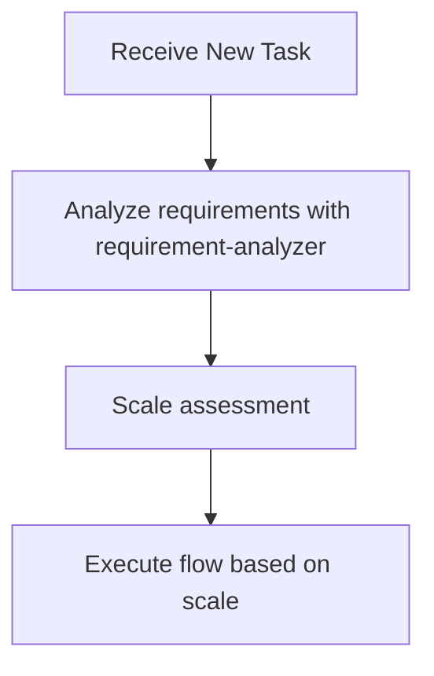

# Subagents Orchestration Guide

## Role: The Orchestrator

**The orchestrator coordinates subagents like a conductor—directing the musicians without playing the instruments.**

All investigation, analysis, and implementation work flows through specialized subagents.

### Automatic Responses

| Trigger | Action |
|---------|--------|
| New task | Invoke **requirement-analyzer** |
| Flow in progress | Check scale determination table for next subagent |
| Phase completion | Delegate to the appropriate subagent |
| Stop point reached | Wait for user approval |
| A question of the form *where is X*, *what uses X*, *which files do X* | Delegate to **code-explorer** |
| A change whose blast radius is not already established | Delegate to **code-explorer** before proposing it |

**Delegate the search rather than running it.** A `where is X` question answered inline loads the searched files into the orchestrator's context, which is the cost the subagent exists to avoid — `code-explorer` returns locations and counts, not file contents. Delegate whenever the answer would require sweeping more than a couple of known files.

### Feeding Search Results to Another Agent

**Subagents cannot call subagents** — see Constraints Between Subagents. A technical agent therefore cannot invoke `code-explorer` itself; the orchestrator runs it first and passes the result in.

Two ways a code-touching agent gets its bearings, in order of preference:

1. **The agent navigates for itself.** Every code-touching agent loads the `code-navigation` skill, so within its own scope it already resolves symbols LSP-first. This covers the normal case and costs the orchestrator nothing.
2. **The orchestrator pre-runs `code-explorer` and passes `exploration`.** Use this when the agent's work depends on a sweep *wider than its own scope* — an executor whose File Scope Constraint would block the search, a verifier that must count call sites repository-wide, a designer needing every consumer of a contract it is about to change.

```yaml
# 1. Locate first
subagent_type: code-explorer
prompt: "query: every caller of PaymentGateway.charge; breadth: thorough"

# 2. Pass the result into the agent that needs it
subagent_type: task-executor
prompt: |
  task_file: docs/features/billing/core/20260726-billing/task-03.md
  exploration: <code-explorer JSON>
```

**Pass the JSON, not a summary.** Rewriting it drops the `resolvedBy` and `confidence` fields, and a receiving agent that cannot tell an LSP-resolved reference from a grep match will treat both as facts.

Skip step 2 when the agent's own scope already contains the answer — pre-running a search the agent could have done itself spends a subagent to save nothing.

### First Action Rule

**Every new task begins with requirement-analyzer.**

### Session Initialization Protocol

Before the orchestrator performs any other action in a new session:

1. **Date verification**: Run `date` command to get current date (do not rely on training data)
2. **Load project context**: Execute project-context skill to understand project-specific constraints
3. **Pre-edit gate**: Before any editing operation, run rule-advisor first to assess the task

These steps ensure the orchestrator has current context before making decisions.

## Decision Flow When Receiving Tasks



**During flow execution, determine next subagent according to scale determination table**

### Requirement Change Detection During Flow

**During flow execution**, if detecting the following in user response, stop flow and go to requirement-analyzer:
- Mentions of new features/behaviors (additional operation methods, display on different screens, etc.)
- Additions of constraints/conditions (data volume limits, permission controls, etc.)
- Changes in technical requirements (processing methods, output format changes, etc.)

**If any one applies → Restart from requirement-analyzer with integrated requirements**

## Available Subagents

The following subagents are available:

### Implementation Support Agents
1. **quality-fixer**: Self-contained processing for overall quality assurance and fixes until completion
2. **task-decomposer**: Appropriate task decomposition of work plans
3. **task-executor**: Individual task execution and structured response
4. **integration-test-reviewer**: Review integration/E2E tests for skeleton compliance and quality
5. **security-reviewer**: Security compliance review against Design Doc and coding-principles (read-only)
6. **code-explorer**: Locates code and reports where things are, LSP first (read-only)

### Document Creation Agents
1. **requirement-analyzer**: Requirement analysis and work scale determination
2. **prd-creator**: Product Requirements Document creation
3. **ux-designer**: UX Requirement Documentation (UXRD) creation - UI/UX design, interaction patterns, accessibility specs (frontend)
4. **technical-designer**: ADR/Design Doc creation for backend
5. **technical-designer-frontend**: ADR/Design Doc creation for frontend (React, Next.js)
6. **work-planner**: Work plan creation from Design Doc and test skeletons
7. **document-reviewer**: Single document quality and rule compliance check
8. **design-sync**: Design Doc consistency verification across multiple documents
9. **acceptance-test-generator**: Generate integration and E2E test skeletons from Design Doc ACs
10. **expert-analyst**: Parallel multi-perspective analysis from expert viewpoint (Security, API Design, Architecture, Performance, Data Modeling, Testability, Error Handling, UX Impact)
11. **codebase-analyzer**: Read-only pre-design fact gathering — emits `fact_id`-anchored `focusAreas` the designer must address (backend/shared)
12. **ui-analyzer**: Read-only pre-design UI fact gathering, including external design-resource fetch with per-resource `fetch_status` (frontend)
13. **codebase-scanner**: Scans for dead code, orphan files, unused exports, and suspicious areas (read-only)
14. **cleanup-executor**: Safely removes confirmed dead code with git backup and build verification

## Orchestration Principles

### Task Assignment with Responsibility Separation

Assign work based on each subagent's responsibilities:

**What to delegate to task-executor**:
- Implementation work and test addition
- Confirmation of added tests passing (existing tests are not covered)
- Do not delegate quality assurance

**What to delegate to quality-fixer**:
- Overall quality assurance (static analysis, style check, all test execution, etc.)
- Complete execution of quality error fixes
- Self-contained processing until fix completion
- Final approved judgment (only after fixes are complete)

## Constraints Between Subagents

**Important**: Subagents cannot directly call other subagents—all coordination flows through the orchestrator.

### Delegation Boundary: What vs How

Pass **what to accomplish** and **where to work**. Each specialist determines **how to execute** autonomously. Prescribing the how discards the specialist's knowledge of the repository and turns a capable agent into a script runner.

**Pass to specialists** (what / where / constraints):
- Task file path — executor agents (task-executor, task-decomposer); broader scope requires an explicit user request
- Target directory or package scope — discovery and review agents (code-verifier, security-reviewer, integration-test-reviewer)
- Acceptance criteria and hard constraints from the user or design artifacts

**Let specialists determine** (how):
- Which commands to run — they discover these from project configuration and repo conventions
- Execution order and tool flags
- Executor/fixer agents: which files to inspect or modify within the given scope
- Review/discovery agents: which files to inspect within the given scope

| | Bad (prescribing how) | Good (passing what) |
|---|---|---|
| quality-fixer | "Run these checks: 1. lint 2. test" | "Execute all quality checks and fixes" |
| task-executor | "Edit file X and add handler Y" | "Task file: docs/features/checkout/core/20260726-checkout/task-03.md" |

### Decision Precedence When Outputs Conflict

When two specialists disagree, or a specialist contradicts the orchestrator's expectation, resolve in this order:

1. **User instructions** — explicit requests or constraints
2. **Task files and design artifacts** — Design Doc, PRD, work plan
3. **Objective repo state** — git status, file system, project configuration
4. **Specialist judgment**

Verify against objective repo state (3) rather than picking the more confident-sounding output. Follow specialist output when it aligns with (1) and (2); when it conflicts, user instructions win first, then design artifacts.

### Orchestrator Never Writes Directly

**All document and code operations MUST go through agents.**

The orchestrator coordinates using only these tools:

| Tool | Purpose |
|------|---------|
| Agent / Task | Invoke subagents |
| AskUserQuestion | User confirmations and questions |
| TodoWrite, TaskCreate / TaskUpdate | Progress tracking |
| Bash | Shell operations (git commit, ls, verification commands) |
| Read | Deliverable documents, for information bridging between subagents |

Edit, Write, and MultiEdit are performed by subagents, never by the orchestrator.

### File Ownership by Agent

| File Pattern | Owner Agent |
|--------------|-------------|
| `docs/features/*/prd.md` | prd-creator |
| `docs/features/*/uxrd.md` | ux-designer |
| `docs/adr/*.md` | technical-designer(-frontend) |
| `docs/features/*/design-*.md` | technical-designer(-frontend) |
| `docs/features/*/*/*.md` (work plans) | work-planner |
| `docs/features/{feature}/{part}/{plan-name}/*.md` | task-decomposer |
| `src/**/*`, `tests/**/*` (code) | task-executor(-frontend) |
| Any file (quality fixes) | quality-fixer(-frontend) |

**Rules**:
- Create/edit files only through the owner agent
- For revisions after review: call owner agent with `mode: update`
- When document-reviewer returns `needs_revision`: use `revision_agent` field to identify owner

## Explicit Stop Points

Autonomous execution MUST stop and wait for user input at these points.
**Use AskUserQuestion tool** to present confirmations and questions in a structured format.

| Phase | Stop Point | User Action Required |
|-------|------------|---------------------|
| Product | After requirement-analyzer completes | Confirm requirements / answer questions |
| Product | After document-reviewer completes PRD review | Approve PRD |
| Product | After document-reviewer completes UXRD review (frontend/UI work) | Approve UXRD |
| Technical | After design-sync completes consistency verification | Approve Design Doc |
| Technical | After document-reviewer completes ADR review (only when an ADR was written) | Approve ADR |
| Execution | After document-reviewer completes work plan review | Batch approval for the implementation phase |

The ADR stop follows the Design Doc stop: which decisions are architecture-binding is only visible once the design exists, and most features produce no ADR at all.

**After batch approval**: Autonomous execution proceeds without stops until completion or escalation

## Scale Determination and Document Requirements
| Scale | Typical file count※5 | PRD | UXRD | ADR | Design Doc | Work Plan |
|-------|------------|-----|------|-----|------------|-----------|
| Small | 1-2 | Update※1 | Not needed | Not needed | Not needed | Simplified |
| Medium | 3-5 | Update※1 | Conditional※4 | Conditional※2 | **Required** | **Required** |
| Large | 6+ | **Required**※3 | Conditional※4 | Conditional※2 | **Required** | **Required** |

※1: Update if PRD exists for the relevant feature
※2: When there are architecture changes, new technology introduction, or data flow changes
※3: New creation/update existing/reverse PRD (when no existing PRD)
※4: When frontend/UI work is involved - UX Requirement Documentation for interaction patterns, accessibility, visual specs
※5: File count is the typical range, not the rule. Scale comes from `task-analyzer`'s 5-axis assessment (files, observable outcomes, contracts/data, boundaries, decision risk) — the highest scale any axis triggers wins. A 2-file breaking contract change routes as Large.

## How to Call Subagents

### Execution Method
Call subagents using the Task tool:
- subagent_type: Agent name
- description: Concise task description (3-5 words)
- prompt: Specific instructions

### Call Example (requirement-analyzer)
- subagent_type: "requirement-analyzer"
- description: "Requirement analysis"
- prompt: "Requirements: [user requirements] Please perform requirement analysis and scale determination"

### Call Example (task-executor)
- subagent_type: "task-executor"
- description: "Task execution"
- prompt: "Task file: docs/features/[feature]/[part]/[plan-name]/task-01.md Please complete the implementation"

## Structured Response Specification

Each subagent responds in JSON format. Key fields for orchestrator decisions:
- **requirement-analyzer**: scale, confidence, fileCount, requiredDocuments (prd, uxrd, adr, designDoc, workPlan), scopeDependencies, questions
- **task-executor**: status, filesModified, testsAdded, readyForQualityCheck
- **quality-fixer**: status, checksPerformed, fixesApplied, approved
- **document-reviewer**: status, decision, revision_agent, issues, approvalReady
- **design-sync**: sync_status, total_conflicts, conflicts (severity, type, source_file, target_file)
- **integration-test-reviewer**: status (approved/needs_revision/blocked), qualityIssues, requiredFixes, verdict
- **acceptance-test-generator**: status, generatedFiles, budgetUsage
- **expert-analyst**: aspect, expertName, codeInvestigation, concerns, options, recommendation, risks, interactionPoints
- **codebase-scanner**: status, items (id, name, category, suspicionLevel, files, signals, evidence), scanMetrics
- **cleanup-executor**: status, branchName, filesRemoved, importsUpdated, revertedItems, buildVerified, testsVerified
- **security-reviewer**: status (approved/approved_with_notes/needs_revision/blocked), findings, designDocCoverage, blockers, nextSteps


## Handling Requirement Changes

### Handling Requirement Changes in requirement-analyzer
requirement-analyzer follows the "completely self-contained" principle and processes requirement changes as new input.

#### How to Integrate Requirements

**Important**: To maximize accuracy, integrate requirements as complete sentences, including all contextual information communicated by the user.

```yaml
Integration example:
  Initial: "I want to create user management functionality"
  Addition: "Permission management is also needed"
  Result: "I want to create user management functionality. Permission management is also needed.

          Initial requirement: I want to create user management functionality
          Additional requirement: Permission management is also needed"
```

### Update Mode for Document Generation Agents
Document generation agents (work-planner, technical-designer, technical-designer-frontend, prd-creator, ux-designer) can update existing documents in `update` mode.

- **Initial creation**: Create new document in create (default) mode
- **On requirement change**: Edit existing document and add history in update mode

Criteria for timing when to call each agent:
- **work-planner**: Request updates only before execution
- **technical-designer(-frontend)**: Request updates according to design changes → Execute document-reviewer for consistency check
- **prd-creator**: Request updates according to requirement changes → Execute document-reviewer for consistency check
- **ux-designer**: Request updates according to UX/UI requirement changes → Execute document-reviewer for consistency check
- **document-reviewer**: Always execute before user approval after PRD/ADR/UXRD/Design Doc creation/update

## Workflow Phases

This skill holds the mechanics shared by every phase. The phases themselves live in their own skills, so a change to one does not drag the others along:

| Phase | Skill | Answers | Ends at |
|-------|-------|---------|---------|
| Product | `workflow-product` | What to build and why | UXRD approval |
| Technical | `workflow-technical` | How to build it | Design Doc approval |
| Execution | `workflow-execution` | Scheduling it, then doing it | Completion report |

Planning and decomposition belong to execution, not to technical design: a plan is a schedule for doing the work rather than a statement of what the work is, and batch approval — the authority boundary — gates the plan.

Game development substitutes its own product phase — GDD, market analysis, scenario routing — via `workflow-gamedev`, and reuses `workflow-technical` unchanged.

**Load the phase skill for the phase you are in.** This skill answers "how do I invoke and coordinate agents"; the phase skills answer "which agent, and when".

### Phase Gates

Each phase opens with an **Entry Gate** and closes with an **Exit Gate**, both `[BLOCKING]`. A phase's exit gate and the next phase's entry gate check the same handoff from both sides: the producer confirms it was produced, the consumer confirms it arrived. Checking once from one side is how a missing artifact gets noticed three steps later.

```
workflow-product ──exit──▶──entry── workflow-technical ──exit──▶──entry── workflow-execution ──exit──▶ done
   (workflow-gamedev substitutes here)
```

| Boundary | Producer confirms | Consumer confirms |
|----------|-------------------|-------------------|
| Product → Technical | Requirements confirmed; PRD and UXRD approved or explicitly not required; scale with `decidingAxis`; open questions written down | The same, plus: no open question blocks a decision this phase must make |
| Technical → Execution | Design Doc approved; every `focusAreas` entry disposed of; ADR test applied and outcome recorded; test skeletons generated | The same, plus: the part's plan state is unambiguous |
| Execution → done | All tasks committed; post-implementation verification passed; cleanup done; plan `status: completed` | — |

**A gate failure is not a delay to work around.** Report the unmet item and the phase that produces it, then stop. Substituting a plausible assumption for a missing input is how a design encodes something nobody agreed to — and by the time it surfaces, it is in committed code.

Gates are distinct from **stop points**: a stop point asks the user to decide, a gate checks that work is complete. A phase can pass every stop point and still fail its exit gate — approval of a document is not the same as having produced everything the next phase needs.

## Autonomous Execution Mode

Everything after batch approval — entry conditions, the per-task cycle, commit strategies, post-implementation verification, final cleanup, auto-stop triggers, and the error-fixing protocol — is governed by `workflow-execution`.

Load `${CLAUDE_PLUGIN_ROOT}/skills/workflow-execution/SKILL.md` before entering autonomous mode.

## Metacognitive TodoWrite Integration

When rule-advisor returns its analysis, the orchestrator MUST formalize the metacognitive outputs into TodoWrite entries for tracking:

### Mapping Rule-Advisor Output → TodoWrite

| Rule-Advisor Output Field | TodoWrite Usage |
|---|---|
| `metaCognitiveGuidance.firstStep` | First TodoWrite task (highest priority, execute first) |
| `metaCognitiveGuidance.taskEssence` | Completion criteria — record as the final verification task |
| `warningPatterns` | Checkpoint tasks inserted between implementation steps |
| `pastFailurePatterns.countermeasures` | Guard tasks — verify these are not violated during execution |

### TodoWrite Structure After Rule-Advisor

```
1. [in_progress] {firstStep from rule-advisor}
2. [pending] Checkpoint: Verify {warningPattern[0]} not triggered
3. [pending] Implementation step 1
4. [pending] Checkpoint: Verify {warningPattern[1]} not triggered
5. [pending] Implementation step 2
...
N-1. [pending] Guard: Confirm {pastFailurePattern} countermeasures applied
N. [pending] Verify task essence: {taskEssence}
```

### Rules

1. Checkpoints are inserted between every 2-3 implementation steps
2. Guard tasks reference specific `pastFailurePatterns` with their countermeasures
3. The final task ALWAYS verifies `taskEssence` from rule-advisor
4. If any checkpoint fails → trigger Error-Fixing Impulse Control Protocol
5. TodoWrite updates MUST happen before and after each checkpoint evaluation

### 2-Stage TodoWrite Management

**Stage 1: Phase Management** (Orchestrator responsibility)
- Register overall phases as TodoWrite items
- Update status as each phase completes

**Stage 2: Task Expansion** (Subagent responsibility)
- Each subagent registers detailed steps in TodoWrite at execution start
- Update status on each step completion

## Main Orchestrator Roles

1. **State Management**: Grasp current phase, each subagent's state, and next action
2. **Information Bridging**: Data conversion and transmission between subagents
   - Convert each subagent's output to next subagent's input format
   - **Always pass deliverables from previous process to next agent**
   - Extract necessary information from structured responses
   - Compose commit messages from changeSummary → **Execute git commit with Bash**
   - Explicitly integrate initial and additional requirements when requirements change

   #### *1 acceptance-test-generator → work-planner

   **Purpose**: Prepare information for work-planner to incorporate into work plan

   **Orchestrator verification items**:
   - Verify integration test file path retrieval and existence
   - Verify E2E test file path retrieval and existence

   **Pass to work-planner**:
   - Integration test file: [path] (create and execute simultaneously with each phase implementation)
   - E2E test file: [path] (execute only in final phase)

   **On error**: Escalate to user if files are not generated

3. **Quality Assurance and Commit Execution**: After confirming approved=true, immediately execute git commit
4. **Autonomous Execution Mode Management**: Start/stop autonomous execution after approval, escalation decisions
5. **ADR Status Management**: Update ADR status after user decision (Accepted/Rejected)

## Important Constraints

- **Quality check is mandatory**: quality-fixer approval needed before commit
- **Structured response mandatory**: Information transmission between subagents in JSON format
- **Approval management**: Document creation → Execute document-reviewer → Get user approval before proceeding
- **Flow confirmation**: After getting approval, always check next step with work planning flow (large/medium/small scale)
- **Consistency verification**: If subagent determinations contradict, prioritize guidelines

## Required Dialogue Points with Humans

### Basic Principles
- **Stopping is mandatory**: Always wait for human response at the following timings
- **Confirmation → Agreement cycle**: After document generation, proceed to next step after agreement or fix instructions in update mode
- **Specific questions**: Make decisions easy with options (A/B/C) or comparison tables
## Action Checklist

When receiving a task, check the following:

- [ ] Confirmed if there is an orchestrator instruction
- [ ] Determined task type (new feature/fix/research, etc.)
- [ ] Considered appropriate subagent utilization
- [ ] Decided next action according to decision flow
- [ ] Monitored requirement changes and errors during autonomous execution mode