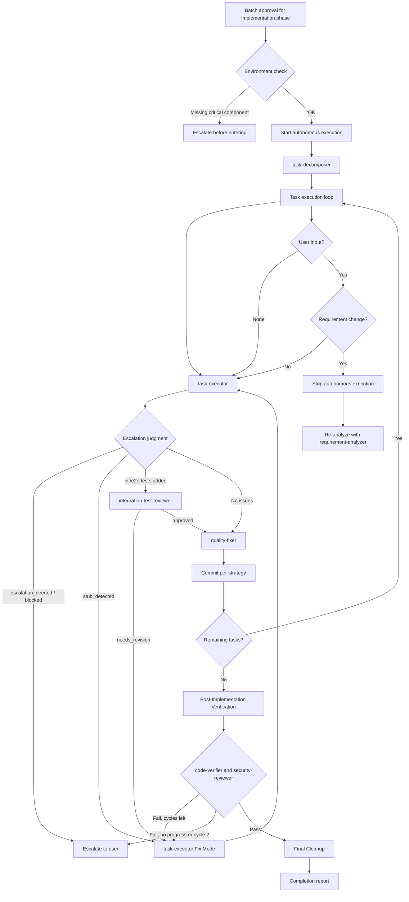

# Autonomous Execution Workflows

Coordination — which subagent runs when, and which documents gate each phase — belongs to the `subagents-orchestration-guide` skill. This skill governs what happens **after** batch approval: the loop that runs without asking permission, and every rule that constrains it.

Autonomy is delegated authority, not absence of limits. Every rule below exists because unbounded execution fails in a specific, observed way: it edits far more than intended, retries a broken approach indefinitely, or reports success on work it never verified.

## Entry Conditions

Autonomous mode starts only after **batch approval for the entire implementation phase**. Before entering, verify the environment supports what the loop assumes.

### Pre-Execution Environment Check

**Principle**: verify subagents can complete their responsibilities.

**Required environments**:
- Commit capability (for the per-task commit cycle)
- Quality check tools (quality-fixer detects and escalates if missing)
- Test runner (task-executor detects and escalates if missing)

**If a critical environment is unavailable**: escalate with the specific missing component *before* entering autonomous mode — discovering it mid-loop wastes the approval and leaves partial work.
**If the gap is detectable by a subagent**: proceed; the subagent escalates with fuller context than a pre-check can produce.

### Authority Delegation

Once the environment check passes, batch approval delegates authority to the subagents:

| Agent | Delegated authority |
|-------|---------------------|
| task-executor(-frontend) | Implementation — may use Edit/Write within its File Scope Constraint |
| quality-fixer(-frontend) | Fix authority — automatic quality error fixes |

The orchestrator itself gains no write authority: it still coordinates only.

## Commit Strategy Selection

**Ask the user at workflow start** — after requirement-analyzer, before implementation begins.

| Strategy | When to Commit | Best For |
|----------|----------------|----------|
| **per-task** | After each task completes | Atomic commits, easy rollback, CI-friendly |
| **per-phase** | After each phase completes | Balanced granularity |
| **per-feature** | Single commit at feature completion | Clean history, squash-like |
| **manual** | User explicitly requests | Full control, interactive workflow |

**Default**: `per-task`.

The strategy affects when `git commit` runs, how quality-fixer cycles are grouped, and commit message granularity. It never affects **whether** quality-fixer runs.

## The Per-Task Cycle

```
1. task-executor        → Implementation
2. Escalation judgment  → Inspect the executor's status before proceeding
3. quality-fixer        → Quality check and fixes
4. [Conditional] commit → Per the selected strategy
```

### Step 2 branch conditions

| Executor reports | Action |
|------------------|--------|
| `status: escalation_needed` or `blocked` | Escalate to user; do not continue the loop |
| `stub_detected` | Return to task-executor in **Fix Mode** with `incompleteImplementations[]`. Do **not** advance to quality-fixer — a stub passes quality checks while implementing nothing. |
| `requiresTestReview: true`, or `testsAdded` contains `*.int.test.ts` / `*.e2e.test.ts` | Run **integration-test-reviewer** before quality-fixer. `needs_revision` → back to task-executor in Fix Mode with `requiredFixes`; `approved` → proceed. |
| No issues | Proceed to quality-fixer |

### Commit execution by strategy

| Strategy | Commit Trigger |
|----------|----------------|
| **per-task** | quality-fixer returns `approved: true` → commit immediately |
| **per-phase** | All tasks in the phase complete + `approved: true` → commit |
| **per-feature** | All phases complete + final `approved: true` → single commit |
| **manual** | User says "commit" or "save progress" → commit staged changes |

**quality-fixer runs after every task regardless of strategy.** Batching commits does not batch quality gates.

## Post-Implementation Verification

The per-task cycle checks each task in isolation. It cannot detect drift between the finished implementation and the Design Doc, nor assess the security posture of the change set as a whole. After **all** task cycles finish — before the completion report — run a whole-implementation pass.

**Invoke both verifiers in parallel** (single message, two Agent calls):

| Verifier | Inputs |
|----------|--------|
| `code-verifier` | `doc_type: design-doc`, Design Doc path, `code_paths` from `git diff --name-only main...HEAD` |
| `security-reviewer` | Design Doc path, same implementation file list |

**Pass/fail criteria**:

| Verifier | Pass | Fail | Blocked |
|----------|------|------|---------|
| `code-verifier` | `consistent` or `mostly_consistent` | `needs_review` or `inconsistent` | — |
| `security-reviewer` | `approved` or `approved_with_notes` | `needs_revision` | `blocked` → escalate to user |

**Normalizing output into one `requiredFixes[]`** — the verifiers emit different shapes and must be reconciled before invoking task-executor:

- `security-reviewer.requiredFixes[]` is already `{location, issue, fix}` → pass through unchanged
- `code-verifier.discrepancies[]` → convert each actionable entry (`drift`, `gap`, `conflict`) to `{location: discrepancy.codeLocation, issue: discrepancy.claim, fix: "<correction restoring Design Doc consistency, derived from classification and evidence>"}`
- When `discrepancy.codeLocation` is `null` (the claim is unimplemented), set `location` to the planned target file. If no target file can be determined, escalate rather than dispatching Fix Mode with an unresolvable location.

**Fix cycle** (any verifier failed — maximum 2 cycles):

1. Create a consolidated fix task file (`docs/features/{feature}/{part}/{plan-name}/post-impl-fixes-YYYYMMDD.md`) from the task template
2. Populate its Target Files with the **union** of file paths from every verifier's `requiredFixes[].location` and `discrepancies[].codeLocation` (parse `file[:line]`, keep the file part). Without this union the executor's File Scope Constraint rejects the very files it was dispatched to fix, because they belong to different original tasks.
3. Invoke `task-executor` in **Fix Mode** with the consolidated path and the normalized array
4. Run `quality-fixer`, then re-run **only the failed verifiers**, retaining recorded evidence from those that passed

**Re-run rule**: a cycle makes progress only when a previously failing verifier reaches a pass status, or its count of named remaining findings decreases. Escalate immediately when a cycle makes no progress or needs external input. After cycle 2, escalate every remaining failure with its findings.

## Final Cleanup

Before the completion report, delete the task directory this run consumed. Its work is committed; the directory is working state, not a durable artifact.

- Delete `docs/features/{feature}/{part}/{plan-name}/` — `task-*.md`, `_overview.md`, `phase*-completion.md`, `analysis/`, and any consolidated fix task file
- Set the plan's frontmatter `status` to `completed`, so the next run resolves the following plan in the chain
- **Preserve** sibling plans and their directories — a part may hold several, and only the executed one is finished
- **Preserve** `prd.md`, `uxrd.md`, `design-{part}.md`, and everything under `docs/adr/`

If deletion fails, report the failure but do not block the completion report.

## Stopping Autonomous Execution

### Conditions that force a stop

1. **Escalation from a subagent** — `status: "escalation_needed"` or `status: "blocked"`
2. **Requirement change detected** — any match in the requirement-change checklist; stop and re-analyze with integrated requirements via requirement-analyzer
3. **Work-planner update restriction violated** — requirement changes after task-decomposer has started require overall redesign; restart the flow from requirement-analyzer
4. **User explicitly stops** — direct instruction or interruption

### Quantitative Auto-Stop Triggers

These numeric thresholds MUST trigger immediate orchestrator action. They are non-negotiable safety boundaries, and they take priority over autonomous mode.

| Trigger Condition | Required Action |
|---|---|
| **5+ files changed** in a single task | STOP. Create an impact report listing all changed files and affected modules. Present to the user before continuing. |
| **Same error occurs 3 times** | STOP. Mandatory root cause analysis via 5 Whys. Do NOT attempt another fix without completing it. |
| **3 files edited** without a TodoWrite update | Force a TodoWrite status update. No further edits until it reflects current progress. |
| **2nd consecutive error fix attempt** | Re-execute rule-advisor. The previous approach has failed — reassess task essence and strategy. |
| **5 cumulative Edit tool uses** | Force an impact report: files changed, modules affected, tests impacted. |
| **3 edits to the same file** | STOP. Consider refactoring instead of incremental patches; present the proposal to the user. |

**Enforcement rules**:

1. Counters reset at the start of each new task
2. The orchestrator tracks edit counts per-file and cumulative
3. Auto-stop triggers take priority over autonomous execution
4. After any auto-stop, present a status report before resuming
5. A user may override with "continue" — but the stop MUST occur first

## Error-Fixing Impulse Control Protocol

When an error appears during implementation, follow this protocol **instead of** immediately attempting a fix. The reflex to patch is what turns one defect into a sequence of increasingly speculative edits.

1. **PAUSE** — do not attempt a fix yet
2. **Re-execute rule-advisor** with the error context:
   ```yaml
   subagent_type: rule-advisor
   prompt: "Re-analyze task considering this error: [error details]. Determine whether the original approach is still valid or a different strategy is needed."
   ```
3. **Root cause analysis** — apply 5 Whys:
   ```
   Error:  [observed error]
   Why 1:  [immediate cause]
   Why 2:  [cause of Why 1]
   Why 3:  [cause of Why 2]
   Why 4:  [cause of Why 3]
   Why 5:  [root cause]
   ```
4. **Present an action plan** — root cause, proposed approach, estimated impact (files to change), risk assessment
5. **Fix only after user approval**

### Applies to

- Any error during task-executor execution
- Build failures after code changes
- Unexpected test failures
- quality-fixer reporting persistent issues

### Does NOT apply to

- Expected test failures during Red-Green-Refactor (the TDD red phase)
- Linting warnings quality-fixer can auto-fix
- Known, documented environment issues

## Execution Flow


